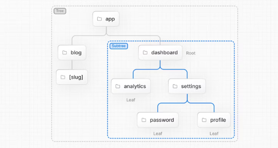
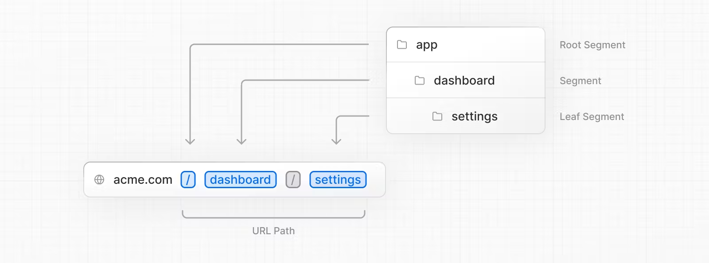
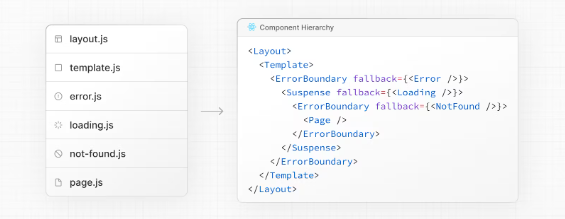
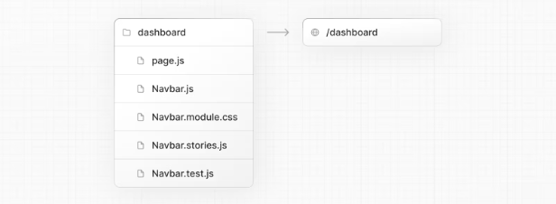
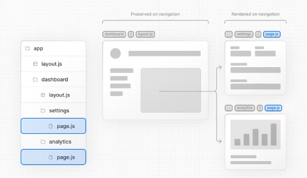

# Routing Fundamentals

공식 문서 : <a>https://nextjs.org/docs/app/building-your-application/routing</a>

모든 애플리케이션의 뼈대는 라우팅입니다.
이 페이지에서는 웹 라우팅의 **기본 개념**과 Next.js에서 라우팅을 처리하는 방법을 소개합니다.

---

### Terminology

먼저, 문서 전체에서 이러한 용어가 사용됩니다.
다음을 통해 빠르게 확인하세요.

- 트리(Tree) : 계층 구조를 시각하기 위한 규칙(convention)입니다. 부모 및 자식 컴포넌트가 있는 컴포넌트 트리, 폴더 구조 등이 트리의 예시 입니다.
- 서브트리(Subtree) : 새 루트(첫 번째)에서 시작해서 리프(마지막)에서 끝나는 트리의 일부입니다.
- 루트(Root) : 루트 레이아웃과 같은 트리(tree) 또는 서브트리(subtree)의 첫 번째 노드입니다.
- 리프(Leaf) : URL 경로의 마지막 세그먼트와 같이 자식이 없는 서브트리의 노드입니다.

- URL 세그먼트(URL Segment) : 슬래시('/')로 구분된 URL 경로의 일부입니다.
- URL 경로(URL Path) : 도메인 뒤에 오는 URL의 일부(세그먼트로 구성)입니다.

---

### The `app` Directory

버전 13에서 Next.js는 공유 레이아웃, 중첩 라우팅, 로딩 상태, 오류 처리(error handling) 등을 지원하는 [React Server 컴포넌트](../../GettingStarted/React_Essentials.md#server-components)에 구축된 새로운 **앱 라우터**를 도입했습니다.

앱 라우터는 `app` 이라는 새 디렉토리에서 작동합니다.
`app` 디렉토리는 incremental adoption을 위해 `pages` 디렉토리와 함께 작동합니다.
이를 통해 애플리케이션의 일부 라우트를 새 동작으로 선택하고 다른 라우트는 이전 동작에 대해 `pages` 디렉터리에 보관할 수 있습니다.
만약 애플리케이션이 `pages` 디렉토리를 사용하는 경우 [Pages Router](./Routing.md) 설명서를 참조하세요.

##### 알아두면 좋은 정보

앱 라우터는 페이지 라우터보다 우선시됩니다.
디렉터리 간 라우트는 동일한 URL 경로로 해석되지 않아야하며 충돌을 방지하기 위해 build-time 오류가 발생할 수 있습니다.

기본적으로, `app` 내부의 컴포넌트는 [React 서버 컴포넌트](../../GettingStarted/React_Essentials.md#server-components)입니다. 이것은 성능 최적화가 가능하고 쉽게 채택할 수 있으며 [클라이언트 컴포넌트](../../GettingStarted/React_Essentials.md#client-components)를 사용할 수도 있습니다.

**권장 사항 :** 서버 컴포넌트를 처음 사용하는 경우 [서버 및 클라이언트 컴포넌트](../../GettingStarted/React_Essentials.md) 페이지를 확인하세요.

---

### Roles of Folders and Files

앱 라우터에서 :

- **폴더**는 라우트를 정의하는 데 사용됩니다. 라우트는 **루트 폴더**에서 `page.js` 파일이 포함된 최종 **리프 폴더**까지의 계층 구조를 따르는 중첩 폴더의 단일 경로입니다.
- **파일**은 라우트 세그먼트에 대해 표시되는 UI를 만드는 데 사용됩니다. [특수 파일](../../BuildingYourApplication/Routing/Routing.md#file-conventions)을 참고하세요.

---

### Route Segments

라우트의 각 폴더는 **라우트 세그먼트**를 나타냅니다.
각 라우트 세그먼트는 **URL 경로**의 해당 **세그먼트**에 매핑됩니다.

---

### Nested Routes

폴더를 중첩시켜서 중첩된 경로를 만들 수 있습니다.
예를 들어, `app` 디렉터리에 두 개의 폴더를 중첩해 새 `/dashboard/settings` 라우트를 추가할 수 있습니다.
`/dashboard/settings` 라우트는 세 개의 세그먼트로 구성됩니다.

- `/` (Root segment)
- `dashboard` (Segment)
- `settings` (Leaf segment)

---

### File Conventions

Next.js는 중첩된 라우트에서 특정 동작으로 UI를 생성하기 위한 특수 파일 세트를 제공합니다.

- [page.js](./Pages_and_Layouts.md#pages) : 라우트의 고유한 UI를 만들고 경로(path)에 공개적으로 액세스할 수 있도록 합니다.
  - [route.js](./Route_Handlers.md) : 라우트에 대한 서버 측 API 엔드포인트를 생성합니다.
- [layout.js](./Pages_and_Layouts.md#layouts) : 세그먼트 및 해당 하위에 대한 공유 UI를 만듭니다. 레이아웃은 페이지 또는 하위 세그먼트를 래핑합니다.
  - [template.js](./Pages_and_Layouts.md#templates) : 네비게이션 시에 새 컴포넌트 인스턴스가 마운트된다는 점을 제외하고 `layout.js`와 유사합니다. 이 동작이 필요하지 않으면 레이아웃을 사용하세요.
- [loading.js](./Loading_UI_and_Streaming.md) : 세그먼트 및 해당 하위에 대한 로딩 UI를 생성합니다. `loading.js` 는 [React Suspense Boundary](https://react.dev/reference/react/Suspense#suspense)에서 페이지 또는 하위 세그먼트를 래핑하여 로드하는 동안 로딩 UI를 표시합니다.
- [error.js](./Error_Handling.md) : 세그먼트 및 해당 하위에 대한 오류 UI를 생성합니다. `error.js` 는 [React Error Boundary](https://reactjs.org/docs/error-boundaries.html)에서 페이지 또는 하위 세그먼트를 래핑하여 오류가 발견되면 오류 UI를 표시합니다.
  - [global-error.js](./Error_Handling.md) : `error.js`와 유사하지만 특히 루트 `layout.js`에서 오류를 포착하기 위해 사용합니다.
- [not-found.js](../../APIReference/FileConventions/not-found.js.md) : 라우트 세그먼트 내에서 [`notFound`](../../APIReference/Functions/notFound.md) 함수가 발생하거나 URL이 어떤 경로와도 일치하지 않을 때 표시할 UI를 만듭니다.

##### 알아두면 좋은 정보

특수 파일에 `.js`, `.jsx` 또는 `.tsx` 파일 확장자를 사용할 수 있습니다.

---

### Component Hierarchy

경로 세그먼트의 특수 파일에 정의된 리액트 컴포넌트는 특정 계층 구조로 렌더링됩니다.

- `layout.js`
- `template.js`
- `error.js` (React error boundary)
- `loading.js` (React suspense boundary)
- `not-found.js` (React error boundary)
- `page.js` or nested `layout.js`

중첩된 라우트에서 세그먼트의 컴포넌트들은 상위 세그먼트의 컴포넌트 내에 중첩됩니다.

---

### Colocation

특수 파일 외에도 폴더 안에 자신의 파일을 함께 배치할 수 있는 옵션이 있습니다.
예를 들어 스타일시트, 테스트, 구성 요소 등이 있습니다.

---

### Server-Centric Routing with Client-side Navigation

클라이언트 사이드 라우팅을 사용하는 `page` 디렉터리와 달리, 앱 라우터는 **서버 중심 라우팅**을 사용하여 [서버 컴포넌트](../../GettingStarted/React_Essentials.md##server-components) 및 [서버 데이터 가져오기](../DataFetching/Fetching.md)에 맞춥니다.
서버 중심 라우팅을 사용하면 클라이언트는 라우트 맵을 다운로드할 필요가 없으며 서버 컴포넌트에 대한 동일한 요청을 사용하여 라우트를 조회할 수 있습니다. 이 최적화는 모든 애플리케이션에 유용하지만 라우트가 많은 애플리케이션에 더 큰 영향을 미칩니다.
라우팅은 서버 중심이지만 라우터는 [Link 컴포넌트](../Routing/Linking_and_Navigating.md#linking)와 함께 **클라이언트 사이드 네비게이션**을 사용합니다. - 단일 페이지 응용 프로그램의 동작과 유사합니다.

즉 사용자가 새 라우트로 이동할 때, 브라우저가 페이지를 다시 로드하지 않습니다.
대신, URL이 업데이트되고 Next.js는 [변경된 세그먼트만 렌더링합니다.](../Routing/Routing.md#partial-rendering)

또한, 사용자가 앱 내에서 이동함에 따라 라우터는 React 서버 컴포넌트 payload의 결과를 **메모리 내 클라이언트 사이드 캐시(cache)에** 저장합니다.
캐시는 모든 레벨에서 무효화를 허용하고 [React의 동시 렌더링](https://react.dev/blog/2022/03/29/react-v18#what-is-concurrent-react)에서 일관성을 보장하는 라우트 세그먼트로 분할됩니다.
이는 특정한 경우에, 이전에 가져온 세그먼트의 캐시를 재사용하여 성능을 더욱 향상시킬 수 있다는 걸 의미합니다.

Link 컴포넌트를 사용하는 방법을 알아보려면 [Linking and Navigationg](../Routing/Linking_and_Navigating.md) 페이지를 확인하세요.

---

### Partial Rendering

형제 경로(예: 아래의 `/dashboard/settings` and `/dashboard/analytics`) 사이를 이동할 때 Next.js는 변경되는 라우트의 레이아웃과 페이지만 가져오고 렌더링합니다.
하위 트리의 세그먼트 위에 있는 항목을 다시 가져오거나 다시 렌더링**하지 않습니다**.
이는 레이아웃을 공유하는 라우트에서 사용자가 형제 페이지 사이를 이동할 때 레이아웃이 유지됨을 의미합니다.

부분 렌더링이 없으면 이동할 때마다 전체 페이지가 서버에서 다시 렌더링됩니다.
업데이트 중인 세그먼트만 렌더링하면 전송되는 데이터의 양과 실행 시간이 줄어들어 성능이 향상됩니다.

---

### Advanced Routing Patterns

앱 라우터는 또한 고급 라우팅 패턴을 구현하는데 도움이 되는 일련의 규칙 제공합니다.
다음이 포함됩니다.

- [Parallel Routes](../Routing/Parallel_Routes.md): 독립적으로 이동할 수 있는 하나의 view에서 두 개 이상의 페이지를 동시에 보여줄 수 있습니다.
  이를 통해 자체 sub-navigation이 있는 분할 view를 만들 수 있습니다. 예) 대시보드
- [Intercepting Routes](../Routing/Intercepting_Routes.md): 라우트를 가로채 다른 라우트의 컨텍스트에 표시할 수 있습니다.
  현재 페이지의 컨텍스트를 유지하는 것이 중요할 때 사용할 수 있습니다.
  예) 하나의 작업을 편집하면서 모든 작업을 볼 수 있거나 피드에서 사진을 확대할 수 있습니다.

이러한 패턴은 더 풍부하고 복잡한 UI를 구축할 수 있도록 해줍니다. 이전에 소규모 팀과 개인 개발자가 구현하기에 복잡했던 기능을 더욱 쉽게 이용할 수 있도록 만들어줍니다.

---

### Next Steps

이제 Next.js에서 라우팅의 기본 사항을 이해했으므로 아래 링크를 따라 첫 번째 라우트를 만드세요.

> [Defining Routes](../Routing/Defining_Routes.md)
>
> Next.js에서 첫 번째 경로를 만드는 방법을 알아보세요.

> [Pages and Layouts](../Routing/Pages_and_Layouts.md)
>
> 앱 라우터로 첫 페이지와 공유 레이아웃을 만드세요.

> [Linking and Navigating](../Routing/Pages_and_Layouts.md)
>
> Next.js에서 navigation이 작동하는 방식과 Link 컴포넌트 및 ‘useRouter’ 훅을 사용하는 방법을 알아보세요.

> [Routes Groups](../Routing/Routes_Groups.md)
>
> 라우트 그룹을 사용하여 Next.js 애플리케이션을 여러 섹션으로 분할할 수 있습니다.

> [Dynamic Routes](../Routing/Dynamic_Routes.md)
>
> 동적 라우트는 동적 데이터에서 프로그래밍 방식으로 라우트 세그먼트를 생성하는데 사용할 수 있습니다.

> [Loading UI and Streaming](../Routing/Loading_UI_and_Streaming.md)
>
> Suspense 위에 구축된 Loading UI를 사용하면 특정 라우트 세그먼트에 대한 폴백을 만들고 준비가 되면 콘텐츠를 자동으로 스트리밍할 수 있습니다.

> [Error Handling](../Routing/Error_Handling.md)
>
> React Error Boundary에서 라우트 세그먼트와 중첩된 자식을 자동으로 래핑하여 런타임 오류를 처리합니다.

> [Parallel Routes](../Routing/Parallel_Routes.md)
>
> 독립적으로 이동할 수 있는 동일한 보기에서 하나 이상의 페이지를 동시에 렌더링합니다. 매우 동적인 애플리케이션을 위한 패턴입니다.

> [Intercepting Routes](../Routing/Intercepting_Routes.md)
>
> 모달과 같은 고급 라우팅 패턴에 유용한 브라우저 URL을 마스킹하는 동안 가로채기 라우트를 사용하여 현재 레이아웃 내에서 새 라우트를 로드합니다.

> [Route Handlers](../Routing/Route_Handlers.md)
>
> 웹의 요청 및 응답 API를 사용하여 지정된 라우트에 대한 사용자 지정 요청 핸들러를 만듭니다.

> [Middleware](../Routing/Middleware.md)
>
> 요청이 완료되기 전에 미들웨어를 사용하여 코드를 실행하는 방법 알아보기

> [Internationalization](../Routing/Internationalization.md)
>
> 다국어 라우팅 및 현지화된 콘텐츠로 여러 언어에 대한 지원을 추가합니다.
